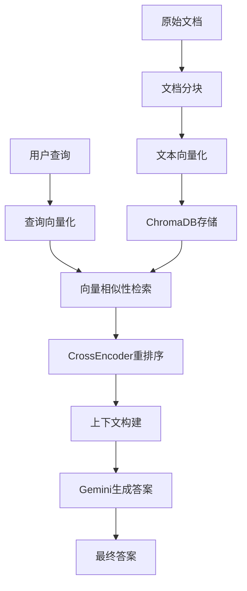

# RAG 检索增强生成问答系统

## 项目概述

这是一个基于 RAG（Retrieval-Augmented Generation）技术的中文问答系统，采用现代化的向量检索和生成式AI技术栈。系统通过文档向量化、语义检索、结果重排序和生成式回答的完整流程，实现了高质量的文档问答功能。

## 技术架构

### 核心技术栈

- **文本嵌入模型**: `shibing624/text2vec-base-chinese` - 专门优化的中文文本向量化模型
- **向量数据库**: ChromaDB - 高性能向量存储和检索引擎
- **重排序模型**: `cross-encoder/mmarco-mMiniLMv2-L12-H384-v1` - 多语言交叉编码器
- **生成模型**: Google Gemini 2.5 Flash - 大语言模型API
- **包管理**: UV - 现代化Python依赖管理工具

### 系统架构图



## 技术实现细节

### 1. 文档处理与分块

```python
def split_into_chunks(file_path: str) -> List[str]:
    with open(file_path) as file:
        content = file.read()
    return content.split("\n")
```

**技术特点:**
- 采用简单的按行分割策略
- 适用于结构化文本数据
- 可扩展为更复杂的分块算法（如滑动窗口、语义分块等）

### 2. 文本向量化引擎

```python
def emabed_chunk(chunk: str) -> List[float]:
    enbadding = m.encode(chunk)
    return enbadding.tolist()
```

**技术实现:**
- 使用 `shibing624/text2vec-base-chinese` 模型
- 基于 Sentence-BERT 架构，专门针对中文优化
- 输出768维向量表示
- 支持批量处理提高效率

### 3. 向量数据库设计

```python
chromadb_client = chromadb.EphemeralClient()
chromadb_collection = chromadb_client.get_or_create_collection("default")

def save_embeddings(embeddings: List[List[float]], chunks: List[str]) -> None:
    for i, embedding in enumerate(embeddings):
        chromadb_collection.add(
            ids=[str(i)],
            embeddings=[embedding],
            metadatas=[{"text": chunks[i]}]
        )
```

**架构特点:**
- 使用 ChromaDB 的内存模式（EphemeralClient）
- 支持向量和元数据的联合存储
- 自动索引构建，支持高效的相似性搜索
- 可扩展为持久化存储模式

### 4. 语义检索算法

```python
def search(query: str, top_k: int = 5) -> List[dict]:
    query_embedding = m.encode(query).tolist()
    results = chromadb_collection.query(
        query_embeddings=[query_embedding],
        n_results=top_k
    )
    return results
```

**检索策略:**
- 基于余弦相似度的向量检索
- 支持 Top-K 结果返回
- 查询时实时向量化
- 返回相似度分数和原始文本

### 5. 结果重排序机制

```python
def re_rank(query: str, results: List[dict]) -> List[dict]:
    scores = cross_encoder.predict([(query, result['text']) for result in results])
    for i, score in enumerate(scores):
        results[i]['score'] = score
    return sorted(results, key=lambda x: x['score'], reverse=True)
```

**重排序技术:**
- 使用 CrossEncoder 进行精确相关性评分
- 基于 mMiniLM 多语言模型
- 查询-文档对的交叉注意力机制
- 显著提升检索精度

### 6. 生成式回答系统

```python
def generate_answer(question: str, chunks: List[str]) -> str:
    prompt = f"根据以下上下文回答问题, 只回答问题相关数据。\n\n上下文: {chunks}\n\n问题: {question}"
    response = genai_client.models.generate_content(
        model="gemini-2.5-flash",
        contents=prompt,
    )
    return response.text
```

**生成策略:**
- 使用 Google Gemini 2.5 Flash 模型
- 精心设计的中文提示词模板
- 基于检索上下文的条件生成
- 支持多轮对话扩展

## 系统流程

### 完整的RAG流程

1. **文档预处理阶段**
   - 读取原始文档 (`data.doc`)
   - 按行分割成文本块
   - 批量向量化处理
   - 存储到 ChromaDB

2. **查询处理阶段**
   - 用户查询向量化
   - 向量相似性检索 (Top-5)
   - CrossEncoder 重排序
   - 构建生成上下文

3. **答案生成阶段**
   - 组装提示词模板
   - 调用 Gemini API
   - 返回最终答案

## 项目结构

```
rag/
├── main.ipynb          # 主要实现代码
├── data.doc           # 示例文档数据
├── .env              # 环境变量配置
├── pyproject.toml    # 项目依赖配置
├── uv.lock          # 依赖锁定文件
└── README.md        # 项目文档
```

## 环境配置

### 依赖项

```toml
[project]
dependencies = [
    "chromadb>=1.0.15",           # 向量数据库
    "google-genai>=1.24.0",       # Google AI SDK
    "python-dotenv>=1.1.1",       # 环境变量管理
    "sentence-transformers>=5.0.0", # 文本嵌入模型
]
```

### 环境变量

```bash
GEMINI_API_KEY=your_gemini_api_key_here
```

## 安装与运行

### 1. 环境准备

```bash
# 确保 Python >= 3.13
python --version

# 安装 UV 包管理器
curl -LsSf https://astral.sh/uv/install.sh | sh
```

### 2. 项目安装

```bash
# 克隆项目
git clone <repository-url>
cd rag

# 安装依赖
uv sync

# 配置环境变量
cp .env.example .env
# 编辑 .env 文件，添加你的 GEMINI_API_KEY
```

### 3. 运行系统

```bash
# 启动 Jupyter Notebook
uv run jupyter notebook main.ipynb

# 或直接运行 Python 脚本
uv run python -c "exec(open('main.ipynb').read())"
```

## 使用示例

### 基本查询示例

```python
# 系统初始化后
query = "易拉罐里有什么"
embeddingResults = search(query)
re_ranked_results = re_rank(query, embeddingResults["metadatas"][0])
answer = generate_answer(query, re_ranked_results)
print(answer)
```

### 预期输出

基于示例文档内容，系统会检索到相关的文本片段并生成类似以下的回答：

```
根据上下文，易拉罐里有塑料玫瑰花，花瓣正在一片片变成阿司匹林药片。
```

## 技术优势

### 1. 中文优化
- 专门的中文文本嵌入模型
- 中文提示词工程
- 多语言重排序支持

### 2. 高性能架构
- 向量化批处理
- 内存数据库加速
- 异步API调用支持

### 3. 模块化设计
- 清晰的功能分离
- 易于扩展和维护
- 支持不同模型替换

### 4. 精确检索
- 双阶段检索策略
- 语义相似性 + 交叉编码器
- 显著提升相关性

## 性能优化建议

### 1. 向量存储优化
```python
# 使用持久化存储
chromadb_client = chromadb.PersistentClient(path="./chroma_db")

# 批量插入优化
def batch_save_embeddings(embeddings, chunks, batch_size=100):
    for i in range(0, len(embeddings), batch_size):
        batch_embeddings = embeddings[i:i+batch_size]
        batch_chunks = chunks[i:i+batch_size]
        # 批量插入逻辑
```

### 2. 模型加载优化
```python
# 模型缓存
@lru_cache(maxsize=1)
def get_embedding_model():
    return SentenceTransformer("shibing624/text2vec-base-chinese")

# GPU 加速
model = SentenceTransformer("shibing624/text2vec-base-chinese", device='cuda')
```

### 3. 检索优化
```python
# 异步检索
import asyncio

async def async_search(query: str, top_k: int = 5):
    # 异步检索实现
    pass
```

## 扩展功能

### 1. 多文档支持
- 文档分类和标记
- 跨文档检索
- 文档权重调整

### 2. 对话历史
- 会话状态管理
- 上下文记忆
- 多轮对话优化

### 3. 实时更新
- 增量文档添加
- 动态索引更新
- 热更新支持

## 故障排除

### 常见问题

1. **模型下载失败**
   ```bash
   # 手动下载模型
   python -c "from sentence_transformers import SentenceTransformer; SentenceTransformer('shibing624/text2vec-base-chinese')"
   ```

2. **API 调用失败**
   - 检查 GEMINI_API_KEY 配置
   - 验证网络连接
   - 查看 API 配额限制

3. **内存不足**
   - 减少批处理大小
   - 使用持久化存储
   - 启用模型量化

## 技术路线图

- [ ] 支持更多文档格式 (PDF, DOCX, HTML)
- [ ] 实现流式生成回答
- [ ] 添加检索结果可视化
- [ ] 支持多模态检索 (图文混合)
- [ ] 集成更多向量数据库选项
- [ ] 实现分布式部署支持

## 贡献指南

欢迎提交 Issue 和 Pull Request 来改进项目。请确保：

1. 代码符合 PEP 8 规范
2. 添加适当的测试用例
3. 更新相关文档
4. 提供详细的变更说明

## 许可证

本项目采用 MIT 许可证，详见 LICENSE 文件。